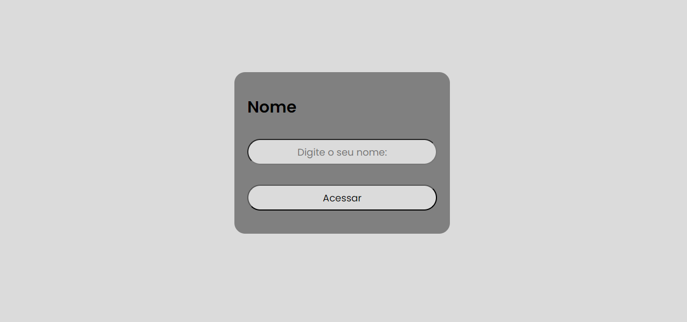
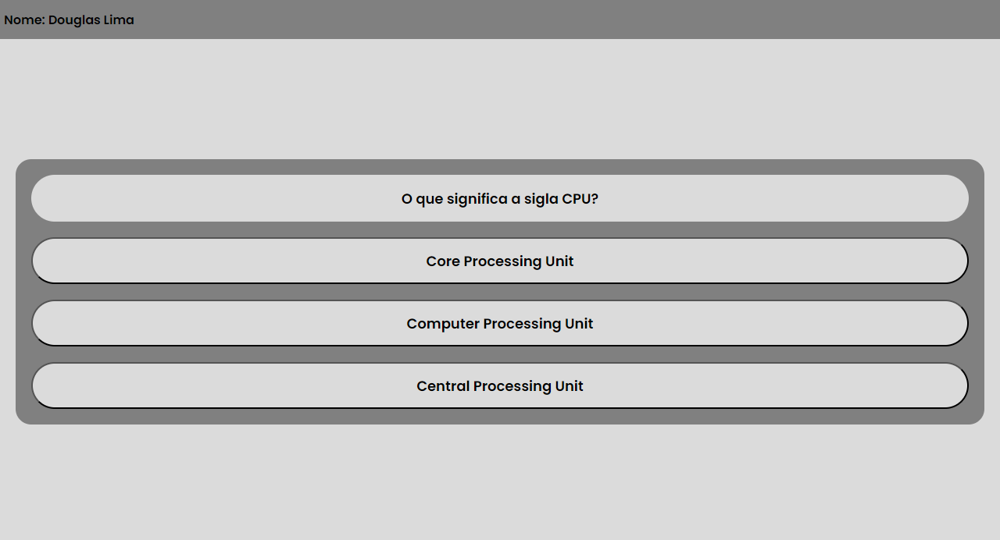
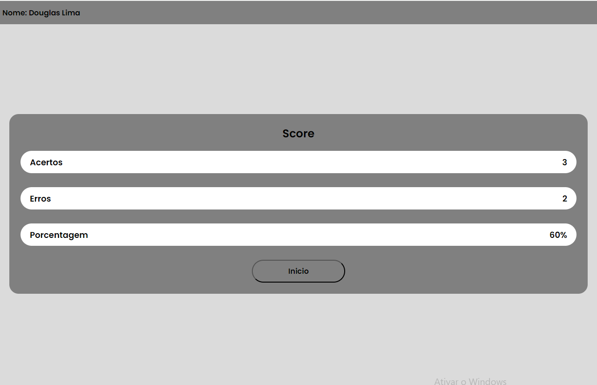

# Desafio técnico Front-end (React)

## Quiz de perguntas aleatórias, utilizando a tecnológia React js, CSS.

## Para clonar o repositorio siga as instruções abaixo.

### - Antes de iniciar a clonagem do projeto é necessario ter instalado em sua máquina as seguintes ferramentas. 

### - GitHub , editor de códico.

### - Execute o seguinte comando no seu terminal git clone https://github.com/Douglaslima93/Desafio-front-end

### - cd Desafio-front-end

### - npm install

### - npm run dev

### - Digite h + enter em seguida o + enter, o deploy irá abrir.

###  
###  
###  

